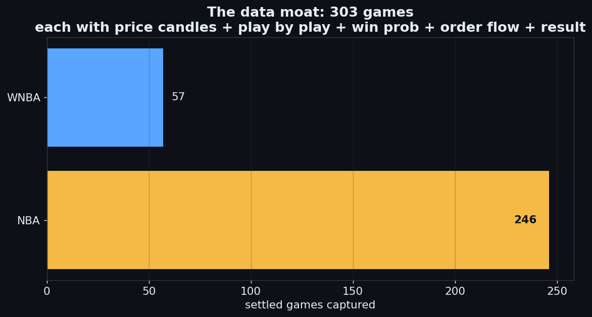
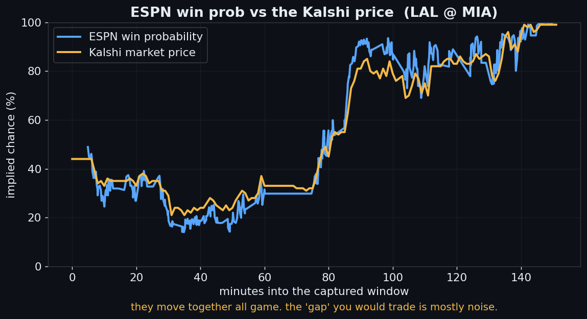
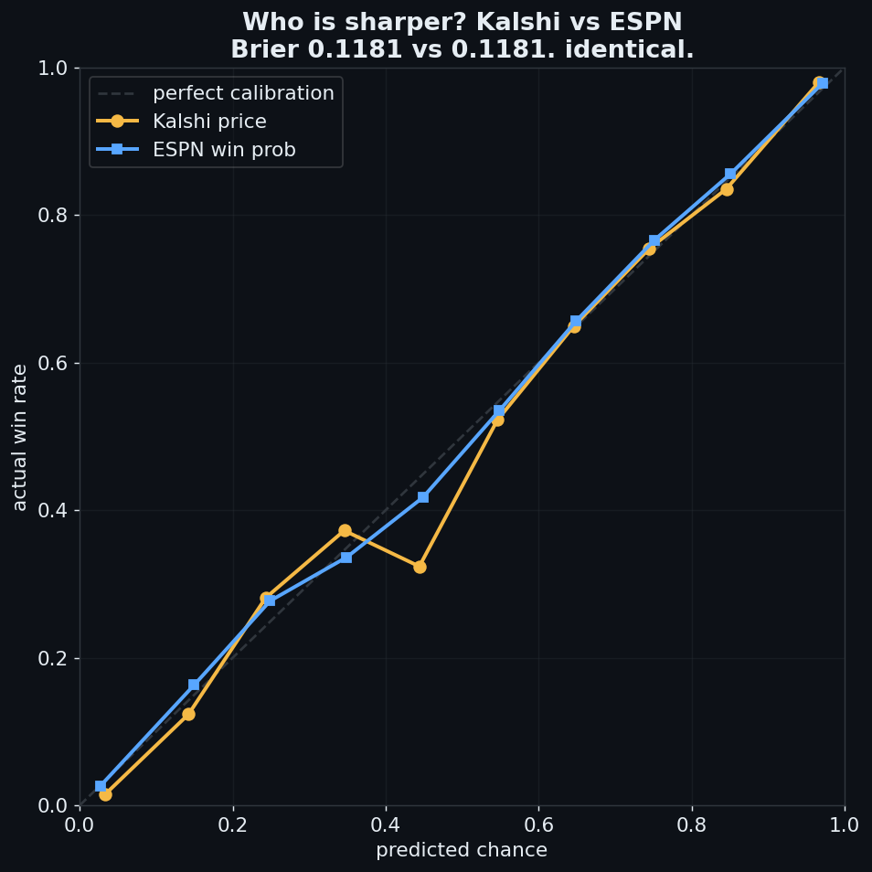
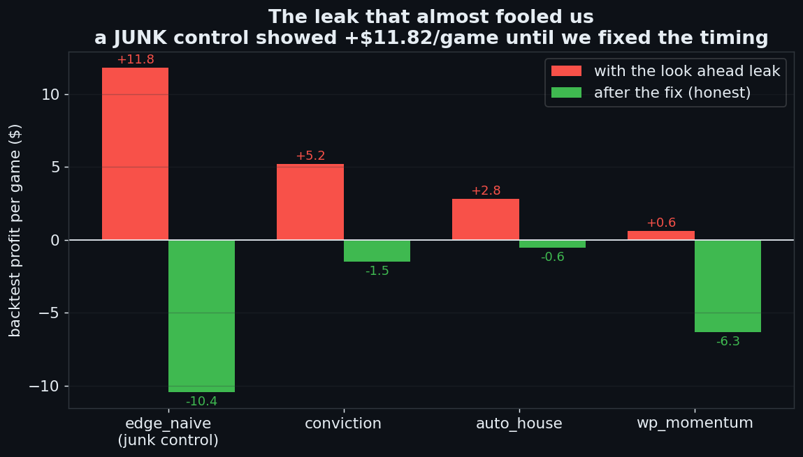
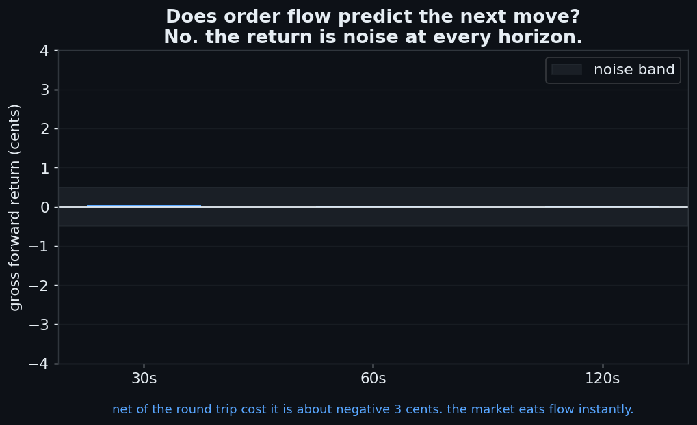
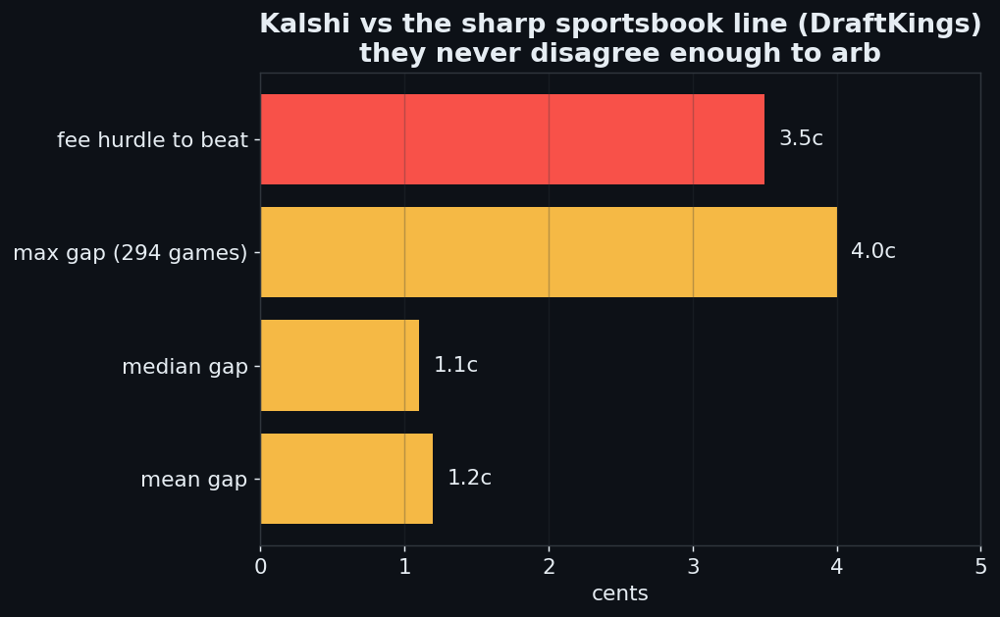
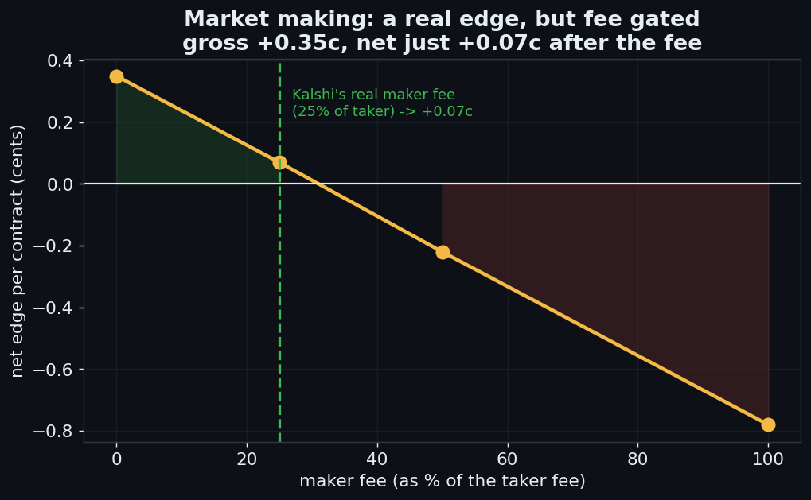

# I built a robot to beat Kalshi sports markets. The market won. Here is everything I tried and what I learned.

So I had this idea. Kalshi lets you trade real money on whether a team wins a game. The
price moves live, like a stock. I figured: ESPN gives away a live win probability for free,
the price and the win probability should disagree sometimes, and when they disagree you bet
the gap and print money. Easy. Right?

I gave the whole thing to an AI, told it to act like a quant, and let it loose. Then I
watched what happened. This is the story, with the actual work shown.

## The lab

I did not build a strategy first. I built the machine that would test every strategy
properly.

A **capture daemon** sits on a free Google Cloud box, awake 24/7. For every NBA and WNBA
game it records the Kalshi market (bid, ask, last, every public trade) every time it
changes, plus the ESPN play by play with the live win probability. Event based logging,
so a full game is one or two megabytes on disk, not thirty.

A **backtest engine** replays a finished game second by second. It pays the real Kalshi fee
on every fill, crosses a realistic spread for slippage, and never lets a strategy see future
data. That last part will become important.

A **data moat**. Every settled game gets saved as a single gzipped record: price candles,
play by play, win probability per play, the condensed order flow, and the official Kalshi
result. We ended up with 303 games on disk, 246 NBA and 57 WNBA, all open in the repo.

And a **research loop**. A headless AI wakes up daily, reads how the lab is doing on one
single north star metric, and tries one new idea. The goal was a system that improves
itself.

Then I let it hunt.

## Experiment one: trade the ESPN gap

The thesis was simple. ESPN ships a live win probability for every NBA game, computed by
their model from the score, time, possession, and so on. Kalshi has a price for the same
event. When they disagree, bet the side ESPN favors. That is what every retail trader on
prediction markets seems to do.

Before writing the strategy I asked the only question that matters: **is ESPN actually
better than the market?** If they are equally calibrated, there is nothing to trade. The
"gap" is just noise around a shared best estimate.

Here is a real game from the corpus, Lakers at Heat. The blue line is ESPN's win probability,
the orange is the Kalshi market price, plotted over the same minutes. Lakers crash to 15%,
recover, and win. Watch how tightly the two lines move together.

The "gap" you were going to trade is the thin space between those two lines. That should
make you nervous.

## How you measure "who is sharper": the Brier score

If you predict 70% chance and the team wins, your error is 0.30. If you predict 70% and they
lose, your error is 0.70. Square the error. Average it over many predictions. That is the
Brier score. Lower is sharper.

I pooled every play of every game in the corpus. About 118,000 observations. For each
observation I had the ESPN win probability at that moment and the Kalshi mid price at the
same moment. Plus the eventual game outcome.

Brier for the Kalshi price: **0.1181.**
Brier for the ESPN win prob: **0.1181.**

Identical to four decimal places. I plotted the reliability curve (predicted chance on the
x axis, actual win rate on the y axis) and both lines sit right on top of perfect
calibration, almost on top of each other.

That is a result. The market has already eaten everything ESPN's model knows. The gap is
not information. Trading it is trading noise around a shared estimate. Game over for the
obvious strategy.

But the surprising part came next.

## The bug that almost fooled me

My backtest had a control strategy in it on purpose. I called it `edge_naive`. It is the
dumbest possible thing: any time the model price and the market price differ by more than a
tiny threshold, trade the gap. It is supposed to LOSE money. It exists to prove the test is
honest. If a known dumb strategy starts winning, your test is lying.

It was showing **plus $11.82 per game** over 246 games and 29,000 trades. The "real"
strategies were also showing positive numbers around plus $5 per game.

I was suspicious for one reason only: the calibration test had just told me there is no
edge. If the gap has no information, no gap based strategy should win, including ones with
clever rules on top. The fact that even the junk strategy was winning meant the backtest was
broken, not that I had found alpha.

## Diagnosing it

I traced one decision. The bot saw a scoring play at minute 22, the ESPN win probability
jumped to 0.62, and the bot bought at a Kalshi price of 0.50. Six cents of "edge." Sounds
great.

Except the Kalshi price the bot used was the close of a one minute candle that ended at
minute 21. The scoring play happened at minute 22. So the bot was buying at a price from
BEFORE the play happened. By minute 22 the real Kalshi market had already moved to about
0.62, just like the win probability. There was no 6 cent edge. There was a 0 cent edge and
a stale price.

**The strategy was peeking into the past and calling it skill.**

In real trading, by the time a signal forms, the price has already moved. Your fill happens
at the post move price, not the pre move price. My backtest let strategies fill at the pre
move price. Free money, in simulation only.

## The fix

The fix is one line of doctrine: a signal at time T can only transact at the price that
comes AFTER T. In our setup, that meant filling at the candle that closes after the play,
not the one that closed before it. The new code is called `fill_candle` and it is the most
important commit in the repo.

What happened to the numbers:

| strategy | leaked (before fix) | honest (after fix) |
|---|---|---|
| edge_naive (the junk control) | +$11.82/game | negative $10.45/game |
| conviction | +$5.22/game | negative $1.51/game |
| auto_house (was the "winner") | +$2.82/game | negative $0.56/game |
| wp_momentum | +$0.61/game | negative $6.32/game |

The junk strategy flipped from plus 11.82 to negative 10.45. That is the signature of a
clean fix. Anti edges should lose money once you stop letting them peek. The fact that they
do is how you know the engine is honest now.

Every single "winning" strategy was negative once the engine was honest. That tracks with
the calibration result perfectly: if there is no information in the gap, every gap based
strategy loses to fees.

## Two lessons from one bug

First, **leaks do not give you a wrong answer. They give you a flattering one.** Wrong
answers get caught because they fail in obvious ways. Flattering answers get funded, scaled
up, and then they bleed in production. The bug I had was the dangerous kind because it
agreed with what I wanted to find.

Second, **put a known bad strategy in your test on purpose and treat its winning as an
emergency.** That single guard rail was the only reason I caught this. Without the junk
control I would have looked at conviction at plus $5.22 per game, declared victory, and
started trading.

The cost of the bug, had I funded it, would have been a slow grind to zero plus fees. The
cost of catching it was one afternoon of stack tracing.

## Experiment two: order flow

Okay, the gap is dead. But maybe speed wins. Maybe the actual buying and selling, the order
flow, predicts the next little move before the price catches up. I had every public trade,
so I checked.

I tagged every trade by whether the buyer was lifting the ask (positive flow) or the seller
was hitting the bid (negative flow). Then I bucketed those into 30 second windows and built
a per game series of signed flow. About 1.5 million trades across the 303 games.

Then I ran two tests:

- **Cross correlation.** Does a positive flow window at time T predict a positive price
  move at T plus 30 seconds? T plus 60? T plus 120? I computed the correlation at every lag
  from negative 8 seconds to positive 8 seconds.
- **Event study.** For every big flow burst (top 5% of windows by absolute size), what is
  the average price move in the next 30, 60, 120 seconds, signed by the direction of the
  flow?

Result: the correlations are all between negative 0.02 and positive 0.03. Noise. The event
study average is one tenth of a cent, in either direction.

After paying the spread to enter and exit, the strategy nets about negative 3 cents per
trade. The market absorbs the information in trades essentially instantly. There is nothing
left to scalp.

This is itself a finding. Liquid prediction markets have very fast information processing
at the microstructure level. If there were a slow informed flow signal, it would show up at
positive lag in the cross correlation. It does not.

## Experiment three: arbitrage against the sportsbook

New angle. If Kalshi is calibrated against ESPN, maybe it is NOT calibrated against the
sharp sportsbook line. Sportsbooks like DraftKings have a small edge from years of taking
real action. If Kalshi diverges from the sharp line, you can arb them.

ESPN quietly hands you DraftKings odds for free in their summary endpoint. Convert the
American moneyline to implied probability with the standard formula (positive ML gives
100/(ML+100), negative ML gives ML/(ML+100)). Then **de vig**: a sportsbook bakes in a
small margin so the home and away implied probabilities sum to more than one. Divide each by
the sum to get the fair implied probability. That is the closing line.

I compared the de vigged DraftKings closing line to the Kalshi market price at tip off
across 294 NBA games.

- Mean absolute gap: **1.2 cents.**
- Median: **1.1 cents.**
- Maximum, across all 294 games: **4.0 cents.**
- Number of games where the gap was bigger than 5 cents: **zero.**

The round trip fee on Kalshi for a game priced near 50/50 is about 3.5 cents. The biggest
gap I ever saw was 4 cents. So even on the best day, the gap was barely bigger than the cost
to capture it, and on average it was way smaller.

And the Brier scores: Kalshi 0.1928, DraftKings 0.1929. Kalshi was actually a hair
sharper than the book.

That is two independent witnesses telling me the same thing: Kalshi prices NBA games
correctly, by every measure I can run.

## Experiment four: market making

Last serious idea. Stop predicting anything. Just quote both sides and earn the spread, like
a tiny casino. The risk in market making is called **adverse selection**: you get filled
right before the price moves against you, because the trader who hit your quote often knew
something you did not.

I decomposed market making profitability on our captured tape. For every taker trade, I
was hypothetically the maker on the other side. So:

- **Half spread earned** = the distance from the fill price to the mid at the time of the
  fill. If you sell at the ask, you earn half the spread.
- **Adverse selection** = the move of the mid against your new position over the next 30
  seconds. If you sold at the ask and the mid then jumped up, you got picked off.
- **Realized spread** = half spread minus adverse selection. This is your gross edge per
  fill before fees.

Across 214,801 captured fills, the median spread was 1.0 cent and the average realized
spread was **plus 0.35 cents per contract**. Adverse selection took about 0.15 cents of the
half spread. The remainder, 0.35 cents, is real money. Mild adverse selection, real gross
edge.

Then the fee. Kalshi charges makers a fee with formula 0.0175 times the contract count
times P times (1 minus P). That works out to about 0.28 cents per contract on average.

So net per contract: plus 0.35 cents gross, minus 0.28 cents fee, equals **plus 0.07 cents
net**. Technically positive. Too thin to be a business.

This is a real category of finding, not a failure. The edge exists. It is the venue's fee
that makes it not worth chasing. If Kalshi exempted makers (as some exchanges do for
liquidity providers), this becomes a real strategy. With the current fee, it is not. And
that is the right level of detail to know.

## What I actually learned

A few things, in rough order of how much they would help a reader.

**One. Liquid markets eat your edge before you find it.** Anything you can see for free on
ESPN, ten thousand smart retail and a handful of pros see too, and the price has already
priced it in. The Brier score of 0.1181 is a fact about how good the market is, not how bad
ESPN is. ESPN is great. The market is just as great.

**Two. The most dangerous bugs are the ones that make you look smart.** If your strategy is
winning more than the basic rules of finance allow, the most likely explanation is that your
test is broken. Build the test to embarrass itself. Put junk strategies in it. Trust the one
that calls itself bad.

**Three. Look ahead leaks in event based backtests are very easy to introduce.** The signal
arrives instantly (a play, a score, a flag). The price you have is the close of the bar
before. Always fill at the price that arrives after your signal time, never the price that
ended before it.

**Four. In efficient markets the only real edge left is structural, not predictive.** Market
making, fee arbitrage, liquidity provision. None of these require you to be smarter than the
market. They require you to be a better operator than other operators. That is a different
game and the fee schedule decides whether it is winnable.

**Five. Knowing where the money is NOT is worth a lot.** Most blog posts about prediction
markets are people sharing strategies that secretly have look ahead bugs. I now have a
clean, OOS validated map of five dead ends in this market. I will not waste another hour on
them. Neither should you.

## So did it work

Not on sports. But proving that, rigorously, on 303 games, with calibration plus the leak
fix plus the order flow scan plus the cross venue check plus the market making decomposition,
is itself a real result. I now know exactly which avenues are dead and why. Most people
trading these markets do not.

The same logic that killed sports points to where an edge should live. Not a popular market
everyone watches. A market governed by something you can actually model, that the sharps do
not bother with. I found a lead in that direction. I am heads down on it now, quietly.

Everything in this post is reproducible. The repo, the 303 games of data, the calibration
scan, the leak fix, the market making decomposition, all of it:

**github.com/sayujjain04/Kalshi-Strat-Tester**

Go check my work. Tell me where I am wrong.

I built a machine to find treasure and instead drew a very good map of where it is not. That
turns out to be most of the job.
